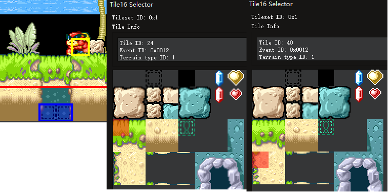
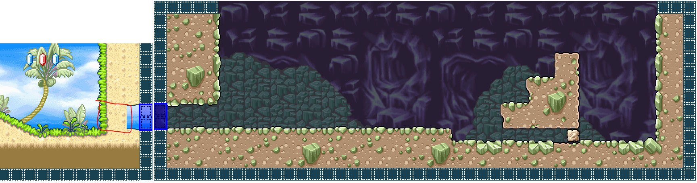

# WL4Editor user helpfile
  
## Part 1: About ROM and Level Loading
  
There are 3 official Wario Land 4 ROM, English version, Japanese version and Chinese version. In this period, we only support editing English version of WL4 ROM, the editor will check the ROM header to see if your ROM is an  English version, loading any other file is not permitted. If you are using a ROM with other language translated by some other 3rd-party team, then if the resourxe ROM they used is an English version, you perhaps will be able to make levels using this editor, but the functionailty to change the levels' names won't be able to work correctly for sure.  
You can select which Level to load by using the Button "Load Level", and switch to different Room in the current Level by using the Buttons "<" and ">".  
  
## Part 2: About editing mode
After you opening the ROM in the editor and it renders out the first Room from level ``Hall of Hieroglyphs``, you can find a Dockwindow on the right side of the Mainwindow named ``Visibility and Editing Controls``. you can choosean edit mode in Mainwindow here, the default mode is ``Layer`` means Layers editing.  
#### MAP edtting
In ``Layer`` mode, ``Tile16 Selector`` Dockwindow shows up, you can click and select Tile16 from the GraphicView and click to put the Tile16 into the Room. Always make sure which layer you are editing on, you can know it by have a look at which Layer you have selected in ``Visibility and Editing Controls`` Dockwindow. Remember that you cannot put Tile16 onto Layer 3, it is for background layer only, that Layer use Tile8x8 but not Tile16 for mapping, and we just have not supported editing that yet.  
There are up to 4 Layers totally in one Room numbered from 0 to 3, not all of them will be used in the Room. If the CheckBox of a Layer is disabled, then it is unused in this Room and you cannot select and edit it. you can enable/disable Layer 0, 2 and 3(Background Layer) by changgin configuration in ``Room Config Dialog``(menu -> Edit -> Room Config). You always need at least one Layer(Layer 1) to put MAP16 in a Room.  
Layers can have different priority orders in different Rooms and Levels, you can find the priority in ``Room Config Dialog``. Priority also affect the graphic effect when you apply color composition to them. The Game engine let the Layer 0 be able to color-composite to the Layer(s) under it, it is called color(alpha) blending of the Layer 0. You can open ``Room Config Dialog``, enable/disable Layer 0 color blending and pick a blending params solution to configure the color blending effect. it use this calculation to blend color for all the three color channels:  
``final_color = Layer0_color x param_1 + underlying_graphic_color x param_2``  
It is color blending let the Rooms have semi-transparent water and stream, and different light and shadow areas under electric lamps, etc. Use color blending of Layer 0 flexibly can make better and inspiring Levels. To have a look at the original Layer 0 without color blending, unselect CheckBox "A"(Alpha) in ``Visibility and Editing Controls`` Dockwindow.  
#### Door editing
All the places in Rooms causing Wario warp or indirectly warp into a different place are called Doors. so it is obvious that they have different types, vortex and real door and instant warp are different. You can switch to Door editing mode by selecting "Door" RadioButtom in ``Visibility and Editing Controls`` Dockwindow.  
the Blue rectangles rendered in the Room show the size and the place of all the Doors in the current Room. you can select Door in Door editing mode, click the selected Door again to open ``Door Config Dialog``. most of the things in this dialog is self-evident, only some of them need an explanation.  
The BGM is saved and ordered using a global Id, go out from a Door can change/unchange the BGM, if you set a new id(not 0) for the current Door, then the BGM will be changed, if you set it to 0, it will continually play the previous BGM.  
Also EntitySet is saved in Door data. There is a Room in ``Arabic Night``, you go into a pipe and the Enimies in the Room change to bees/bats. it is an evidence that EntitySet configuration param is saved in Door data. The whole thing is complicated. Every Room has 3 Entity lists(only include local Entity id numbers) which save place and Entity Id appearing in 3 different difficulties. The game engine cannot load all the graphics of all the Entities in to the RAM so every time it can load a part of them. Each part are made into a set called EntitySet. Every Door can have its own EntitySet Id flag to let the Room show up different Enimies. So you should pick up a proper EntitySet for each Door.  
According to the hacking and the ROM data, we temporarily divided all the doors into five categories. the first for vortex only, the second is warp, then Door or Pipe, Items shop, Boss door. the classification method is good in most of the cases. but we still don't know how to deal with some exceptions in some of the Level. In Level ``Toy Block Tower``, a lot of Doors are type 1, we don't know why they are different though. So pick up a Door sensibly when you are editing them.  
  
**Note: other editing modes are still under implementation**  
  
## Part 3: Details in the Editor
#### ``Tile16 Selector`` and Tile Information in ``Tile16 Selector``
All the Tile16s are made of Tile8x8s, there is only information of how many Tile8x8s are loaded in a Tileset but there is no information that how many Tile16 we should generate( the data used to generate Tile16s are saved in one-dimensional array, but there is no hint to know the end of the array). So we just try to generate Tile16s as much as possible, you can always find rubbish Tile16s on the tail of the whole Tile16s map, don't use them only if you know what you are doing.  
Besides the Tile16 Id, you can also find an ``Event ID`` and a ``Wario Animation Slot ID`` for each Tile16. The ``Event ID`` is for what will happen when Wario knocks into the Tile16. Breaking a block, getting a ruby, going into a Pipe, etc. all of these things need different code to deal with in the game engine when the game is running. The game engine use different Id to jump to different code when they need them. The ``Wario Animation Slot ID`` indexes the slot functions sets, when Wario does different action(You press different keys to control Wario) on that Tile16, different things will happen, which mostly only cause Wario action changes. You will find all the solid Tile16 are all numvered 0x01 as their ``Wario Animation Slot ID``. Using these two params, you can know how those unused Tile16s will react to Wario's different actions now. Here is an example:  
  
You may know the place in the first graphic, you can control Wario ground-pound here and warp into another Room. We find the Tile16 in the ``Tile16 Selector``, and find its Event Id is 0x12. Perhaps you will find another unused Tile16, it has a same Event Id in the third graphic. Then we can guess that, if Wario attact it, those Tile16s will disappear with leaves scattered around. We can put these unused Tile16s here to make this hidden Room enterable.  
  
